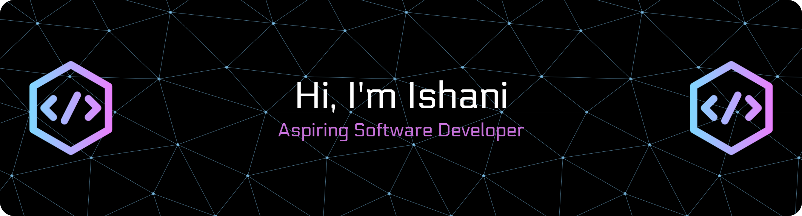

<h2 align="center">✨ About Me ✨</h2>

<h3 align = "center">💻 Computer Science student at SRM University</h3> 
<h4 align = "center">🌱 Currently learning: Full Stack Development & Machine Learning</h4> 
<h4 align = "center">🚀 Exploring: Cloud Computing | Blockchain | UI/UX Design</h4> 
<h4 align = "center">📊 Interests: Data Science | Natural Language Processing | Deep Learning</h4> 
<h4 align = "center">💡 Know more about me → www.linkedin.com/in/ishani-nag-13563423a </h4>
<h4 align = "center">📫 Reach me at: ishaninag19@gmail.com</h4>

## 🌐 Socials:
   

# 💻 Tech Stack:
                                       
# 📊 GitHub Stats:
 
 

<!-- Proudly created with GPRM ( https://gprm.itsvg.in ) -->

### 🔝 Top Contributed Repo

---

<!-- Proudly created with GPRM ( https://gprm.itsvg.in ) -->

